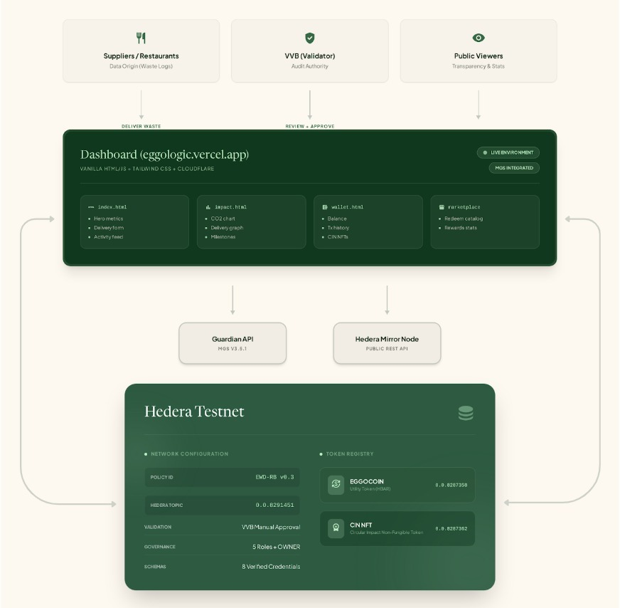

# Eggologic — System Architecture

## Overview

Eggologic runs on a **two-layer architecture** with zero middleware. The dashboard (static frontend hosted on GitHub Pages) communicates directly with two APIs: Guardian MGS for policy operations and Hedera Mirror Node for on-chain data.

<p align="center">
  
</p>

---

## Why No Middleware

Previous iterations used a Node.js/Express middleware layer that polled Google Sheets, transformed data, and submitted to Guardian. This was eliminated because:

| Problem with middleware | Solution without it |
|---|---|
| Extra server to host and maintain | Dashboard is static (GitHub Pages, free) |
| Google Sheets as data source — fragile, rate-limited | Dashboard form submits directly to Guardian API |
| Middleware did calculations that Guardian should do | All business logic lives in the policy |
| Single point of failure between user and blockchain | Direct API calls — fewer failure points |
| CORS issues between middleware ↔ Guardian | Dashboard handles CORS with offline fallback |

**Result**: The entire system runs with zero infrastructure cost. GitHub Pages hosts the frontend. Guardian MGS is the managed backend. Hedera Mirror Node provides public data. No servers, no databases, no cron jobs.

---

## Dashboard Architecture

### Module Responsibilities

| Module | File | Reads From | Writes To |
|---|---|---|---|
| **Config** | `config.js` | — | — |
| **Guardian API** | `api.js` | Guardian MGS (JWT auth) | Guardian MGS (delivery submission) |
| **Hedera Mirror** | `hedera.js` | Mirror Node (public) | — |
| **UI Utilities** | `ui.js` | DOM | DOM |
| **Dashboard** | `dashboard.js` | api.js + hedera.js | Guardian (delivery form) |
| **Impact** | `impact.js` | api.js + hedera.js | — |
| **Wallet** | `wallet.js` | hedera.js | — |
| **Marketplace** | `marketplace.js` | hedera.js | — |

### Authentication Flow

```
User selects role → enters email + password
        │
        ▼
api.js POST /accounts/loginByEmail
        │
        ▼
Guardian returns refreshToken
        │
        ▼
api.js POST /accounts/access-token
        │
        ▼
Guardian returns accessToken (JWT, 30min TTL)
        │
        ▼
Stored in localStorage (email, tokens, role, hedera account)
        │
        ▼
Auto-refresh 2 min before expiry (TOKEN_TTL_MS = 28min)
```

**Offline mode**: If Guardian API is unreachable (CORS, downtime), the dashboard stores a fake auth token and operates in read-only mode using:
- `data/guardian-cache.json` — pre-fetched VC data
- Hedera Mirror Node — always available (public, no CORS)

### Data Flow Per Screen

**index.html (Dashboard)**
```
loadGlobalMetrics()
├── GuardianAPI.getBlockData(VVB_DELIVERY)  →  extract all delivery VCs
│   ├── Sum kg_ingreso (field8) across all deliveries → hero "Waste Diverted"
│   └── Sum kg_ajustados (field12) × 0.70 → hero "CO₂ Avoided"
└── Static: hero "Eggs Produced" (1,020)

loadUserData()  [requires login]
├── HederaMirror.getEggocoinBalance(accountId) → wallet balance widget
├── HederaMirror.getTransactions(accountId)     → recent tx list
└── loadRecentActivity(accountId)               → activity feed

submitDeliveryForm()  [requires login as Project_Proponent]
├── Read form inputs: kg_bruto, kg_impropios, waste_type, evidence
├── Calculate locally: kg_netos, kg_ajustados, ratio, category
├── POST to Guardian: /policies/{id}/blocks/{PP_DELIVERY_FORM}
│   body: { document: { field0..field17 }, ref: null }
└── Refresh metrics on success
```

**impact.html (Impact Report)**
```
loadImpact()
├── HederaMirror.getEggocoinSupply()           → total EGGOCOIN minted
├── GuardianAPI.getBlockData(VVB_DELIVERY)     → all delivery VCs
│   ├── Count approved vs rejected → aggregate score %
│   ├── Sum kg_ajustados × 0.70 → CO₂ avoidance ring chart
│   └── Per-delivery bars → waste chart visualization
└── Fallback: hardcoded delivery data if API fails
```

**wallet.html (Wallet)**
```
loadGlobalWallet()  [public]
├── HederaMirror.getEggocoinSupply()    → supply growth %
├── HederaMirror.getAllBalances()        → all EGGOCOIN holders list
├── HederaMirror.getCITSupply()         → total CIN NFTs minted
└── HederaMirror.getAllCITNfts()         → CIN mint log (serial, holder, date)

loadUserWallet()  [requires login]
├── HederaMirror.getEggocoinBalance()   → personal $EGGO balance
├── HederaMirror.getTransactions()      → full tx history
└── HederaMirror.getUserCIT()           → personal CIN NFT count
```

**marketplace.html (Marketplace)**
```
loadMarketplace()  [public]
├── HederaMirror.getEggocoinSupply()    → H₂O saved calc (supply × 8.9 liters)
└── Static: m² reforested (450)
```

---

## Guardian Policy Architecture

### Policy: EWD-RB v0.3

The policy uses `interfaceContainerBlock` as root, with `policyRolesBlock` for role assignment and `interfaceStepBlock` containers for each role's workflow.

```
interfaceContainerBlock (root, ANY_ROLE)
│
├── policyRolesBlock (NO_ROLE)
│   └── Roles: Registry, Project_Proponent, Operator, VVB
│
├── interfaceStepBlock (OWNER)
│   ├── Submit Impact Calculation
│   ├── Approval by VVB → mintDocumentBlock (CIN NFT, field10)
│   ├── Issuance Record
│   ├── Token History (VP documents)
│   └── Trust Chain
│
├── interfaceStepBlock (Registry)
│   ├── Review Supplier Registrations
│   └── Approve / Reject
│
├── interfaceStepBlock (Project_Proponent)
│   ├── Register as Supplier → approval by Registry
│   └── Submit Waste Delivery → approval by VVB → mintDocumentBlock (EGGOCOIN, field12)
│
├── interfaceStepBlock (Operator)
│   ├── Submit Waste Batch (no approval needed)
│   └── Submit Production Output (no approval needed)
│
└── interfaceStepBlock (VVB)
    ├── Review & Approve Waste Deliveries → triggers EGGOCOIN mint
    ├── Review & Approve Impact Calculations → triggers CIN mint
    ├── Submit VVB Assessment Record
    └── Submit External Validation Record
```

### What the Policy Does NOT Have

These blocks do **not** exist in the published policy:

- ~~`calculateContainerBlock`~~ — no on-chain calculations
- ~~`calculateMathAddon`~~ — no formula execution in Guardian
- ~~`switchBlock`~~ — no conditional routing (rejection is manual)
- ~~`aggregateDocumentBlock`~~ — no automatic batch aggregation
- ~~`sendToGuardianBlock` with `dataType: "hedera"`~~ — no direct HCS logging

All calculations (kg_netos, kg_ajustados, category, CO₂) are done **client-side** in the dashboard. The policy is a **document workflow engine** — submit, review, approve, mint.

### Schema-to-Block Mapping

| Schema | Submitted Via | Block Type | Approval | Mint Trigger |
|---|---|---|---|---|
| Supplier Registration | Project_Proponent | requestVcDocumentBlock | Registry | — |
| Waste Delivery | Project_Proponent | requestVcDocumentBlock | **VVB** | **EGGOCOIN** (field12) |
| Waste Batch | Operator | requestVcDocumentBlock | None | — |
| Production Output | Operator | requestVcDocumentBlock | None | — |
| Impact Calculation | OWNER | requestVcDocumentBlock | **VVB** | **CIN NFT** (field10) |
| VVB Assessment | VVB | requestVcDocumentBlock | None | — |
| External Validation | VVB | requestVcDocumentBlock | None | — |
| Issuance Record | System | documentSourceBlock | None | — |

### Delivery VC Document Structure

When Project_Proponent submits a Waste Delivery, the document sent to Guardian uses generic field names:

```json
{
  "document": {
    "field0": "EWD-RB",
    "field1": "0.3",
    "field2": "v0.3",
    "field3": "v0.3",
    "field4": "ENT-001",
    "field5": "SUP-001",
    "field6": "2026-03-21T12:00:00.000Z",
    "field7": "food_scraps",
    "field8": 48.5,
    "field9": 3.2,
    "field10": 6.6,
    "field11": 45.3,
    "field12": 31.71,
    "field13": "B",
    "field14": true,
    "field15": ["https://evidence.eggologic.com/ENT-001"],
    "field16": "Submitted",
    "field17": ["https://evidence.eggologic.com/ENT-001"]
  },
  "ref": null
}
```

**Field mapping**:

| Field | Name | Type | Description |
|---|---|---|---|
| field0 | methodology | string | Always "EWD-RB" |
| field1 | version_number | string | "0.3" |
| field2 | version_tag | string | "v0.3" |
| field3 | schema_version | string | "v0.3" |
| field4 | id_entrega | string | Delivery ID (ENT-XXX) |
| field5 | id_proveedor | string | Supplier ID (SUP-XXX) |
| field6 | fecha | datetime | Delivery timestamp (ISO 8601) |
| field7 | tipo_residuo | string | Waste type |
| field8 | kg_ingreso / kg_brutos | number | Gross weight in kg |
| field9 | kg_impropios | number | Contamination weight in kg |
| field10 | pct_impropios | number | Contamination ratio % |
| field11 | kg_netos | number | Net weight (field8 - field9) |
| field12 | kg_ajustados | number | Adjusted weight (field11 × 0.70) — **EGGOCOIN mint amount** |
| field13 | categoria | string | Quality category (A/B/C) |
| field14 | cumple_requisitos | boolean | Meets requirements |
| field15 | evidencia_fotografica | array | Photo evidence URLs |
| field16 | estado | string | Status |
| field17 | documentos_soporte | array | Supporting document URLs |

---

## Hedera Integration Points

### Mirror Node Queries (hedera.js)

| Function | Endpoint | Returns |
|---|---|---|
| `getEggocoinBalance(id)` | `/api/v1/tokens/{token}/balances?account.id={id}` | User's $EGGO balance |
| `getEggocoinSupply()` | `/api/v1/tokens/{token}` | Total supply, name, symbol, decimals |
| `getTransactions(id)` | `/api/v1/transactions?account.id={id}&type=CRYPTOTRANSFER` | Recent EGGOCOIN transfers |
| `getAllBalances()` | `/api/v1/tokens/{token}/balances` | All EGGOCOIN holders |
| `getNFTs(id)` | `/api/v1/tokens/{nft}/nfts?account.id={id}` | User's CIN NFTs |
| `getCITSupply()` | `/api/v1/tokens/{nft}` | Total CIN NFTs minted |
| `getAllCITNfts()` | `/api/v1/tokens/{nft}/nfts` | All CIN NFTs (serial, holder, timestamp) |
| `getMintEvents()` | `/api/v1/transactions?account.id={treasury}&type=TOKENMINT` | All mint transactions |

### Guardian API Calls (api.js)

| Function | Method | Endpoint | Purpose |
|---|---|---|---|
| `login(email, pass)` | POST | `/accounts/loginByEmail` | Get refreshToken |
| `_getAccessToken(rt)` | POST | `/accounts/access-token` | Get JWT accessToken |
| `get(path)` | GET | `/policies/{id}/blocks/{blockId}` | Read block data (VCs) |
| `post(path, body)` | POST | `/policies/{id}/blocks/{blockId}` | Submit document to block |
| `submitDelivery(doc)` | POST | `/policies/{id}/blocks/{PP_DELIVERY_FORM}` | Submit Waste Delivery VC |
| `getBlockData(blockId)` | GET | `/policies/{id}/blocks/{blockId}` | Read with cache fallback |

### Token Mint Flow

```
                        Dashboard                    Guardian                     Hedera
                           │                            │                           │
Project_Proponent          │                            │                           │
fills delivery form ──────►│                            │                           │
                           │  POST /blocks/{form_block} │                           │
                           │───────────────────────────►│                           │
                           │                            │ Create VC                 │
                           │                            │ Status: "Waiting"         │
                           │                            │                           │
VVB logs into              │                            │                           │
Guardian UI ──────────────►│                            │                           │
                           │  GET /blocks/{vvb_block}   │                           │
                           │───────────────────────────►│                           │
                           │◄───────────────────────────│ Returns pending VCs       │
                           │                            │                           │
VVB clicks                 │                            │                           │
"Approve" ────────────────►│                            │                           │
                           │  POST /blocks/{vvb_block}  │                           │
                           │  { option: { status: 1 } } │                           │
                           │───────────────────────────►│                           │
                           │                            │ mintDocumentBlock fires   │
                           │                            │──────────────────────────►│
                           │                            │                           │ TokenMint tx
                           │                            │                           │ (field12 amount)
                           │                            │◄──────────────────────────│
                           │                            │ VC status → "Approved"    │
                           │                            │                           │
Dashboard reads             │                            │                           │
Mirror Node ───────────────│────────────────────────────│──────────────────────────►│
                           │                            │                           │ Returns new
                           │◄───────────────────────────│───────────────────────────│ balance
                           │ UI updates balance         │                           │
```

---

## Registered Accounts (Testnet)

| Role | Email | Hedera ID | Purpose |
|---|---|---|---|
| OWNER | r.aguileira88@gmail.com | 0.0.7166777 | System admin, Impact Calculations |
| Registry | eggologic-registry@outlook.com | 0.0.8292724 | Approve supplier registrations |
| Project_Proponent | eggologic-proponent@outlook.com | 0.0.8294621 | Submit waste deliveries |
| Operator | eggologic-operator@outlook.com | 0.0.8294659 | Record batches, production |
| VVB | eggologic-vvb@outlook.com | 0.0.8294709 | Validate & approve (triggers mints) |

---

## Guardian Block IDs (Published Policy)

These are the specific block UUIDs from the published EWD-RB v0.3 policy:

```javascript
BLOCKS: {
  VVB_DELIVERY:      '3a5afd50-d4a5-49ca-866b-75477790ae4c',  // VVB sees pending deliveries
  VVB_IMPACT_CALC:   'a77f0551-9cce-41c9-889d-c7b1110c059e',  // VVB sees pending impact calcs
  TOKEN_HISTORY:     'cd9ed4c2-ff79-474c-bd7c-6a9c525c6035',  // VP document history
  REGISTRY_SUPPLIER: 'd6b1e092-59c1-48af-8671-1a5dfdeaaddb',  // Registry sees supplier requests
  PP_DELIVERY_FORM:  'b322eaa1-7611-4704-be60-b033db83dadb',  // Project_Proponent delivery form
}
```

**Note**: Block UUIDs change if the policy is republished. The dashboard uses UUIDs (not tags) because this policy version is final.

---

## Offline Resilience

The dashboard handles API failures gracefully:

| Failure | Fallback |
|---|---|
| Guardian API down | `data/guardian-cache.json` (pre-fetched VCs) |
| Guardian API CORS | Offline mode auth (read-only, no submissions) |
| Mirror Node down | Hardcoded metric values |
| Both APIs down | Static fallback data for all screens |

The `guardian-cache.json` file is generated by `fetch-guardian-cache.js`, which runs locally to pre-fetch VC data and store it as a static JSON file deployed with the dashboard.

---

## Cost Model

| Component | Monthly Cost | Notes |
|---|---|---|
| Dashboard hosting | $0 | GitHub Pages (free) |
| Guardian MGS | Included | Managed service |
| Hedera transactions | ~$0.20 | VCs + mints + HCS messages |
| Domain (optional) | $0 | Using github.io subdomain |
| **Total** | **~$0.20/month** | |

---

## Security Considerations

| Vector | Mitigation |
|---|---|
| Guardian credentials in browser | JWT with 30min TTL, refresh token rotation |
| Unauthorized VC submission | Role-based permissions enforced by Guardian policy |
| Fake delivery data | VVB manual review before any token is minted |
| Dashboard tampering | All mint operations happen server-side in Guardian — dashboard cannot mint |
| Mirror Node data integrity | Mirror Node reflects on-chain state — cannot be spoofed |
| Config exposure (block IDs, accounts) | All are public testnet values — no secrets in code |

---

## Technology Stack

| Layer | Technology | Why |
|---|---|---|
| Frontend | Vanilla HTML/JS + Tailwind (CDN) | Zero build, instant deploy, no dependencies |
| Hosting | GitHub Pages | Free, automatic deploy via GitHub Actions |
| Policy Engine | Guardian MGS v1.5.1 | Managed service — no Docker, no infra |
| Blockchain | Hedera Testnet | Fixed USD fees, HTS + HCS native support |
| Data Queries | Hedera Mirror Node REST API | Public, no auth, real-time on-chain data |
| Fonts | Google Fonts (Plus Jakarta Sans, Newsreader) | Design consistency |
| Icons | Material Symbols | Google's icon library |

**Zero dependencies in production**: No npm packages, no bundler, no framework, no database. The `package.json` at root is only for the GitHub Actions deploy workflow.
